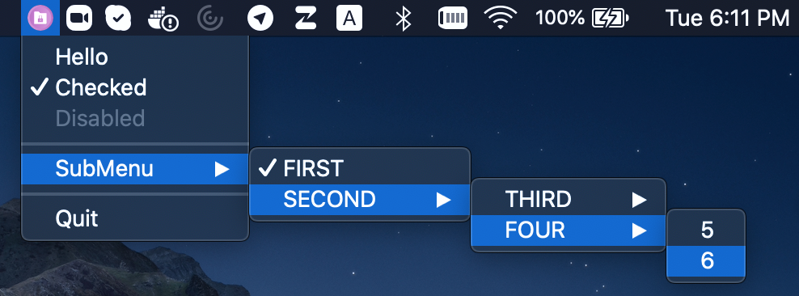
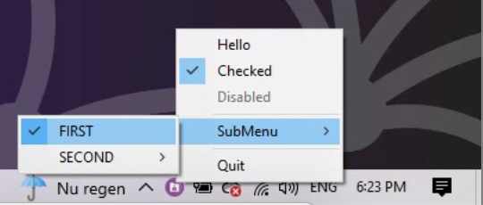
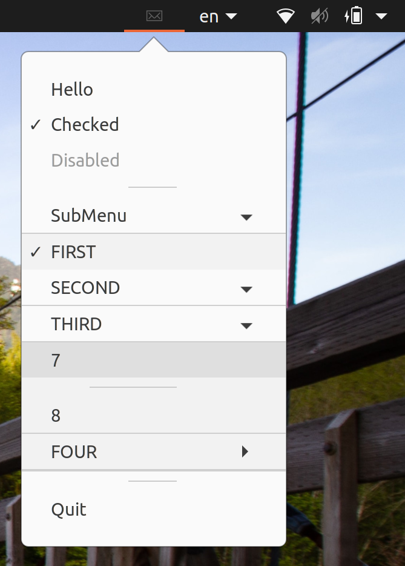

# Cross-platform Linux/Windows/MacOS Tray







Cross-platform, super tiny C99 implementation of a system tray icon with a popup menu.

Works well on:

* Linux/Gtk (libappindicator)
* Windows XP or newer (shellapi.h)
* MacOS (Cocoa/AppKit)

The code is C++ friendly and will compile fine in C++98 and up.

This fork is intended to bring together the [original work of Serge Zaitsev](https://github.com/zserge/tray) and the most interesting forks and PRs of respectable contributors:

* [Only process messages coming from the tray window on Windows](https://github.com/zserge/tray/pull/18)
* [Become C++-friendly](https://github.com/zserge/tray/pull/16)
* [Fix all menu items have a check box](https://github.com/zserge/tray/pull/11)
* [Add support for tooltip](https://github.com/zserge/tray/pull/11)
* Darwin implementation translated from C to Objective C adapted from [@trevex fork](https://github.com/trevex/tray)

## Prerequisites

* CMake
* [Ninja](https://ninja-build.org/), in order to have the same build commands on all platforms
* AppIndicator on Linux:

```
sudo apt install libappindicator3-dev
```

## Building

```
mkdir build
cd build
cmake -G Ninja ..
ninja
```

## Demo

Execute the `tray_example` application:

```
./tray_example
```

## API

Tray structure defines an icon and a menu.
Menu is a NULL-terminated array of items.
Menu item defines menu text, menu checked and disabled (grayed) flags and a
callback with some optional context pointer.

```c
struct tray {
  char *icon;
  struct tray_menu *menu;
};

struct tray_menu {
  char *text;
  int disabled;
  int checked;

  void (*cb)(struct tray_menu *);
  void *context;

  struct tray_menu *submenu;
};
```

* `int tray_init(struct tray *)` - creates tray icon. Returns -1 if tray icon/menu can't be created.
* `void tray_update(struct tray *)` - updates tray icon and menu.
* `int tray_loop(int blocking)` - runs one iteration of the UI loop. Returns -1 if `tray_exit()` has been called.
* `void tray_exit()` - terminates UI loop.

All functions are meant to be called from the UI thread only.

Menu arrays must be terminated with a NULL item, e.g. the last item in the
array must have text field set to NULL.

## License

This software is distributed under [MIT license](http://www.opensource.org/licenses/mit-license.php),
 so feel free to integrate it in your commercial products.

